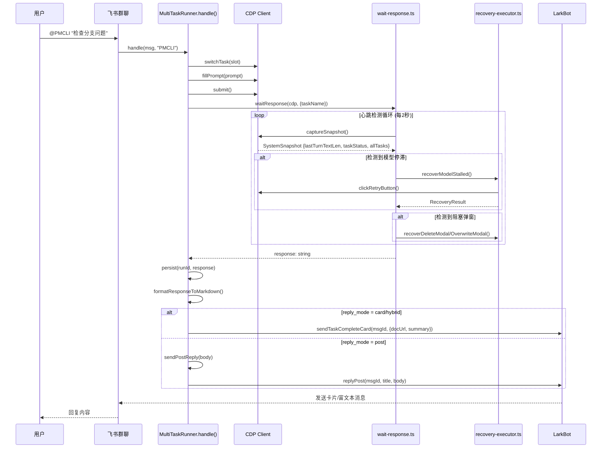

# 因果链追踪报告

**调研时间**: 2026-05-08
**调研目标**: 任务隔离漏洞 - 从 lastTurns 污染到飞书错误回复的传播路径分析

---

## 1. handle() 完整数据流图



---

## 2. wait-response.ts 内部 DOM 操作清单

### 2.1 getLastAIResponse() - 获取最终响应内容

| 行号 | 选择器 | 函数 | 用途 | **是否影响回复** |
|------|--------|------|------|-----------------|
| 252-268 | `document.querySelectorAll('.chat-turn')` | `getLastAIResponse()` | 查找所有 chat-turn，返回最后一个非用户的 | **✅ 是（污染源）** |

**代码位置**: [wait-response.ts:252-268](file:///workspace/mvp-runner/src/actions/wait-response.ts#L252-L268)

```typescript
async function getLastAIResponse(cdp: CDPClient): Promise<string> {
  const result = await cdp.evaluate(`
    (function() {
      const turns = document.querySelectorAll('.chat-turn');  // ❌ 无作用域限制
      if (turns.length === 0) return '';

      for (let i = turns.length - 1; i >= 0; i--) {
        const turn = turns[i];
        if (!turn.classList.contains('user')) {
          let text = turn.innerText || '';
          text = text.replace(/复制图片/g, '').trim();
          return text;  // 返回最后一个非用户的 chat-turn
        }
      }
      return '';
    })()
  `);
  return result || '';
}
```

**关键发现**: 此函数使用**全局** `document.querySelectorAll('.chat-turn')`，会匹配页面上**所有任务**的 chat-turn，而不仅仅是当前执行任务的内容。

### 2.2 getDetailedResult() - 获取详细结果

| 行号 | 选择器 | 函数 | 用途 | **是否影响回复** |
|------|--------|------|------|-----------------|
| 289-310 | `document.querySelectorAll('.chat-turn')` | `getDetailedResult()` | 查找最后一个 AI chat-turn | **✅ 是（污染源）** |
| 320 | `document.querySelectorAll('.chat-turn')` | (内联) | 获取代码块 | **✅ 是（污染源）** |

### 2.3 心跳检测 - captureSnapshot() 调用

**实际调用的是 `state-probe.ts` 的 `captureSnapshot()`**（第69行）：

| 行号 | 选择器 | 用途 | **是否影响回复** |
|------|--------|------|-----------------|
| state-probe.ts:80 | `document.querySelectorAll('.chat-turn')` | 信号2：最后一个 chat-turn 长度 | ❌ 仅用于状态判断 |

---

## 3. recovery 流程对 waitResponse 状态的影响

### 3.1 recovery-executor.ts 中的 lastTurns 使用

**代码位置**: [recovery-executor.ts:466-468](file:///workspace/mvp-runner/src/heartbeat/recovery-executor.ts#L466-L468)

```typescript
// 诊断信息收集
lastTurns: Array.from(document.querySelectorAll('.chat-turn'))
  .slice(-3)
  .map(t => (t.textContent || '').slice(0, 100))
```

**关键发现**: `lastTurns` 仅用于**诊断日志记录**，不参与任何业务逻辑。

### 3.2 recovery 后对 waitResponse 的影响

当 `recoverModelStalled()` 触发重试时：

1. 点击"重试"按钮 → 可能切换到错误的对话
2. DOM 中的 chat-turn 顺序可能发生变化
3. **下一次 `getLastAIResponse()` 调用时，获取的是"当前最后一个 chat-turn"而非"正确任务的 chat-turn"**

**这就是污染传播路径**：

```
recovery 点击重试 → DOM 结构变化 → getLastAIResponse() 获取错误的 chat-turn → 飞书收到错误回复
```

---

## 4. 因果链结论

### 4.1 lastTurns 与错误回复的关系

| 组件 | lastTurns 用途 | 是否影响回复 |
|------|---------------|-------------|
| `recovery-executor.ts` | 诊断日志 | ❌ 否 |
| `state-probe.ts` | 状态判断 | ❌ 否 |
| `wait-response.ts` | **无直接使用** | - |

**结论**: `lastTurns` **不是**真正的污染源。`lastTurns` 变量仅用于诊断目的，不会影响最终的回复内容。

### 4.2 真正的污染源

真正的污染源在 `wait-response.ts` 的 `getLastAIResponse()` 函数：

| 位置 | 问题 |
|------|------|
| [wait-response.ts:254](file:///workspace/mvp-runner/src/actions/wait-response.ts#L254) | `document.querySelectorAll('.chat-turn')` **无作用域限制** |
| [wait-response.ts:291](file:///workspace/mvp-runner/src/actions/wait-response.ts#L291) | `getDetailedResult()` 同样的问题 |
| [wait-response.ts:320](file:///workspace/mvp-runner/src/actions/wait-response.ts#L320) | 代码块提取同样无作用域 |

### 4.3 污染传播路径（完整）

```
1. 用户 @PMCLI "检查分支问题"
2. PMCLI 任务在 slot #3 执行
3. 同时 "现在几点" 任务也在 slot #2 执行
4. recovery 触发（误判 interrupted）
5. recovery 执行 clickRetryButton()
6. 点击操作可能切换了当前活动任务
7. getLastAIResponse() 被调用
8. document.querySelectorAll('.chat-turn') 返回所有任务的 chat-turn
9. 返回最后一个非用户的 chat-turn（可能是 "现在几点" 的回复）
10. 飞书收到错误回复
```

---

## 5. 修复方向

### 5.1 当前代码（有问题）

```typescript
// wait-response.ts:getLastAIResponse()
const turns = document.querySelectorAll('.chat-turn');
```

### 5.2 需要改为（修复方向）

```typescript
// 需要先找到当前活动任务的容器，然后限定作用域
const taskContainer = document.querySelector('.index-module__task-item___zOpfg.selected [class*="chat"]');
const turns = taskContainer?.querySelectorAll('.chat-turn') || [];
```

### 5.3 前置条件

需要确认 DOM 中是否存在以下锚点：
- 当前选中任务容器的 CSS 类（目前使用 `.index-module__task-item___zOpfg.selected`）
- 任务内 chat 区域的容器选择器

---

## 6. 下一步

详见 [dom-anchor-feasibility.md](./dom-anchor-feasibility.md) - DOM 任务锚点可行性验证

---

*调研人员: RESEARCHCLI*
*状态: 已完成*
